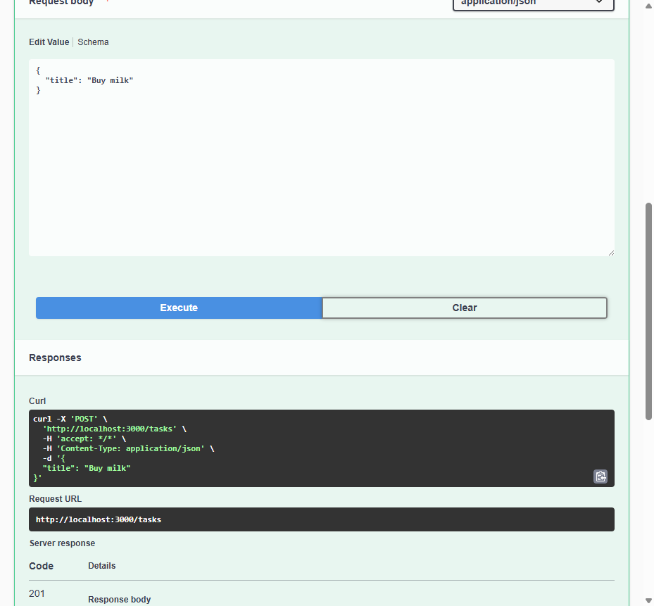

# Task API

A small in-memory CRUD API for managing a to-do list, built with Node.js + Express.

## What this is

Five core endpoints (Create, Read, Update, Delete) over an in-memory list of tasks,
plus a couple of optional extras (filtering, search, stats, reset). Data lives only
in memory — restarting the server resets it to the seed tasks.

## How to run it

```bash
npm install
npm start
```

Server runs at `http://localhost:3000`. Swagger UI (interactive docs) is at
`http://localhost:3000/docs`.

## Endpoints

| Method | Path          | Description                              | Success | Errors        |
|--------|---------------|-------------------------------------------|---------|---------------|
| GET    | `/`           | API description                          | 200     | —             |
| GET    | `/health`     | Health check                             | 200     | —             |
| GET    | `/tasks`      | List all tasks (supports `?done=`, `?search=`, `?limit=`, `?offset=`) | 200 | — |
| GET    | `/tasks/:id`  | Get one task                             | 200     | 404           |
| POST   | `/tasks`      | Create a task (`{ "title": "..." }`)     | 201     | 400           |
| PUT    | `/tasks/:id`  | Update `title` and/or `done`             | 200     | 400, 404      |
| DELETE | `/tasks/:id`  | Delete a task                            | 204     | 404           |
| GET    | `/stats`      | `{ total, done, open }` counts (extra)   | 200     | —             |
| POST   | `/reset`      | Restore the 3 seed tasks (extra)         | 200     | —             |

## Example

```
$ curl -i -X POST http://localhost:3000/tasks -H "Content-Type: application/json" -d '{"title":"Buy milk"}'
HTTP/1.1 201 Created
Content-Type: application/json; charset=utf-8

{"id":4,"title":"Buy milk","done":false}
```

## Swagger UI



*(Replace this with your own screenshot of `/docs` showing the full CRUD cycle via "Try it out".)*

## The mortality experiment

Restarting the server resets `tasks` back to the 3 seed items — anything created,
updated, or deleted during the previous run is gone. That's because the data lives
only in a JavaScript array in the process's memory, not on disk or in a database.
This is exactly why Week 3 introduces persistent storage.

## AI vs me (Stage 7, optional)

*(Fill this in after generating an AI version in `ai-version/`: your prompt, what
the AI did better, what it got wrong or silently decided, and what your prompt
forgot to specify.)*
