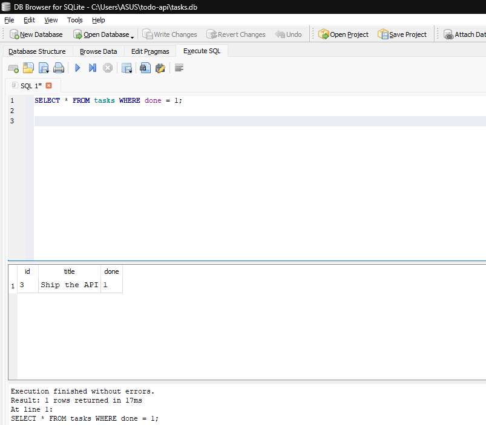

# Task API

A small CRUD API for managing a to-do list, built with Node.js + Express, backed
by a real SQLite database.

## What this is

Five core endpoints (Create, Read, Update, Delete) over a `tasks` table, plus a
couple of optional extras (filtering, search, stats, reset). The API is exactly
the same one from the in-memory version — only the storage layer changed.

## Database

- **Why SQLite:** no separate database server to install or run — it's a single
  file, which is perfect for a small project like this. `better-sqlite3` gives a
  simple synchronous API that's easy to reason about in an Express route handler.
- **Where it lives:** `tasks.db` in the project root. It's git-ignored — running
  the app is what creates it, not cloning the repo.
- **Schema:** one `tasks` table (`id` integer primary key, `title` text, `done`
  boolean), created automatically on first run. The three example tasks are
  inserted only if the table is empty, so restarting the server never duplicates
  them.

## How to run it

```bash
npm install
npm start
```

The first run creates `tasks.db` and seeds it with 3 example tasks. Every run
after that reuses the same file, so your data survives restarts.

Server runs at `http://localhost:3000`. Swagger UI (interactive docs) is at
`http://localhost:3000/docs`.

## Endpoints

| Method | Path          | Description                              | Success | Errors        |
|--------|---------------|-------------------------------------------|---------|---------------|
| GET    | `/`           | API description                          | 200     | —             |
| GET    | `/health`     | Health check                             | 200     | —             |
| GET    | `/tasks`      | List all tasks (supports `?done=`, `?search=`, `?limit=`, `?offset=`) | 200 | — |
| GET    | `/tasks/:id`  | Get one task                             | 200     | 404           |
| POST   | `/tasks`      | Create a task (`{ "title": "..." }`)     | 201     | 400           |
| PUT    | `/tasks/:id`  | Update `title` and/or `done`             | 200     | 400, 404      |
| DELETE | `/tasks/:id`  | Delete a task                            | 204     | 404           |
| GET    | `/stats`      | `{ total, done, open }` counts (extra)   | 200     | —             |
| POST   | `/reset`      | Restore the 3 seed tasks (extra)         | 200     | —             |

## Example

```
$ curl -i -X POST http://localhost:3000/tasks -H "Content-Type: application/json" -d '{"title":"Buy milk"}'
HTTP/1.1 201 Created
X-Powered-By: Express
Content-Type: application/json; charset=utf-8
Content-Length: 40
ETag: W/"28-PpSBYV7i68cXyGc7AhjVpkZkY5Q"
Date: Tue, 08 Sep 2026 02:36:44 GMT
Connection: keep-alive
Keep-Alive: timeout=5

{"id":4,"title":"Buy milk","done":false}
```

## Swagger UI


Screenshot of `/docs` after running "Try it out" on `POST /tasks`: the request
body, generated curl command, request URL, and the live `201 Created` response
from the running server.

## The mortality experiment (Week 2)

The original version of this API kept tasks in a JavaScript array, so
restarting the server wiped everything back to the 3 seed items. That
limitation is what SQLite below fixes — data now lives in `tasks.db` on disk,
not in process memory.

## Exploring the database directly

Opening `tasks.db` in [DB Browser for SQLite](https://sqlitebrowser.org/) and
running queries by hand shows changes reflected immediately through the API —
no restart needed. `queries.sql` has the exact queries used for this.



Example query run directly against the database:

```sql
sqlite> SELECT * FROM tasks WHERE done = 1;
3|Ship the API|1
```

## AI vs me (Stage 7, optional)

I had Claude Code split my `server.js` into stage commits and push the repo,
instead of doing it by hand.

**What it did well:** it actually rebuilt the file stage by stage instead of
faking the history, and diffed the result against my original to make sure
nothing drifted. When I asked it to double check the requirements, it caught
that my README still had a made-up curl example and a "replace this
screenshot" placeholder — it ran the server for real and grabbed an actual
`201` response and a real Swagger screenshot instead of leaving those in.

**What it decided on its own:** the exact stage boundaries (it went off the
`// ---------- Stage N` comments already in my code), the repo name, and
commit message wording — none of which I told it. Nothing risky, just stuff
I hadn't specified.

**What my prompt left out:** how granular "stage-sized" should be, and
whether `/stats` and `/reset` deserved their own stage. It made reasonable
calls, but a more specific prompt would've gotten a more predictable result.
